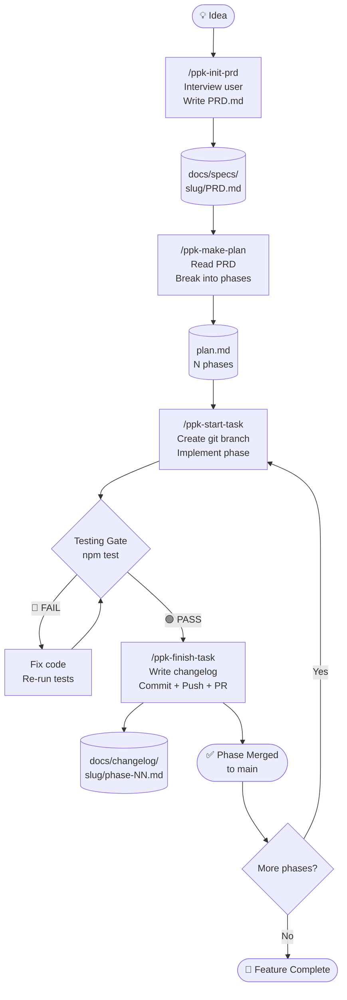
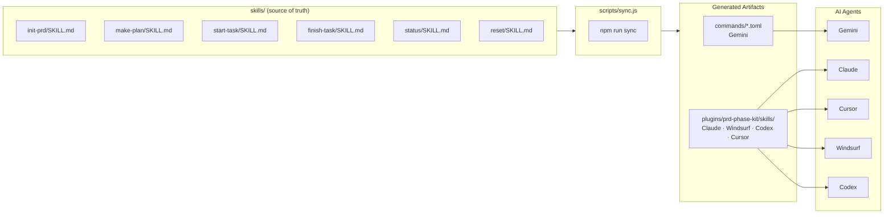
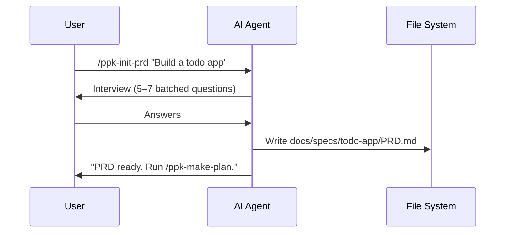
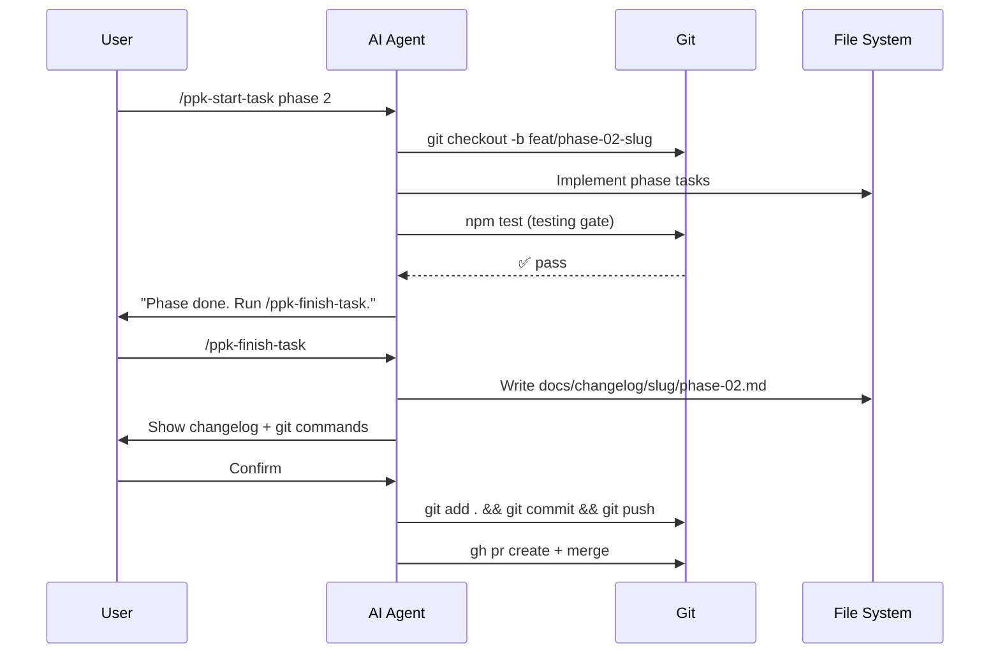

# PRD Phase Kit — Architecture Diagram

Visualizes how an idea transforms into committed code through the PRD Phase Kit workflow.

## Full Workflow Diagram

## Component Map

## Data Flow: `/ppk-init-prd`

## Data Flow: `/ppk-start-task` → `/ppk-finish-task`

